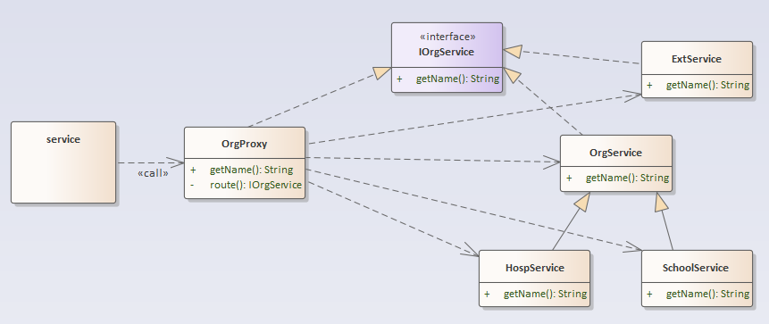
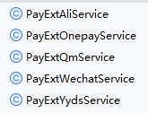

# 概述

该组件用于在Spring环境下，通过接口调用方法时，可通过自定义规则动态分派到接口的各个分支实现。

**环境：**Spring2.2.0及以上

**使用场景：**在环境、出入参、需求等的影响下，接口的同一种行为往往具有多套不同的实现。如接口γ，在不同环境下有：A；AB；CDE。

> 在公司项目中，不同平台、机构通常有很多个性化的需求。
>
> - 对接HIS接口。针对同一个接口方法，以上传HIS为例，由于HIS接口的不一致性，每个机构对接的接口方法都必然有一套独特实现。
> - 对不同机构而言，一个接口方法的行为不一致、行为数量不一致。典型如消息推送，HIS及需求的不一致导致推送的消息类型多样，消息内容多样。

# 版本

0.4.0
- 从my-labs中独立
- 修复同一个父类method被不同实例调用时互串，缓存增加bean作为key。

1.0.0

- 正式发布至central

1.1.0

- 修复bug，当routeKeys缓存分支时，首位routeKey命中缓存后会覆盖修非首位routeKey的缓存，导致以非首位routeKey的分支无法正确命中缓存

# 演示

## demo

定义接口`IOrgService`及其各个实现类（以下简称分支）。每个实现类添加`@StrategyMaster`或者`@StrategyBranch`注解。`@StrategyBranch`注解设置路由的映射值。

类图：


实现代码，包含至多一个`@StrategyMaster`和若干`@StrategyBranch`：

```java
@StrategyMaster
public class OrgService implements IOrgService {
    @Override
    public String getName() {
        return "defaultOrg";
    }
}

@StrategyBranch("ext")
public class ExtService implements IOrgService {
    @Override
    public String getName() {
        return "ext";
    }
}

@StrategyBranch("hosp")
public class HospService extends OrgService {
    @Override
    public String getName() {
        return "hosp";
    }
}

@StrategyBranch("school")
public class SchoolService extends OrgService {
    @Override
    public String getName() {
        return "school";
    }
}

// 自定义复合注解
@P1Branch
@StrategyBranch("p2")
public class PluralService implements IOrgService {
    @Override
    public String getName() {
        return "plural";
    }
}
```

创建代理类`DefaultDynamicStrategyRouter`。

- 实现接口`IStrategyRouter`，重写`#getRouteKeys()`方法，返回内部属性`routeKey`的值，方法返回值匹配`@StrategyBranch`注解的值。该方法的实现可根据项目规则自定义，一般`routeKey`是在项目公共的上下文参数，如机构id。

```java
public class DefaultDynamicStrategyRouter extends IStrategyRouter {
    public static ThreadLocal<String> routeKey = new ThreadLocal<>();

    @Override
    protected String[] getRouteKeys(Object obj, Method method, Object[] args, MethodProxy methodProxy) {
        // 返回routeKey
        return new String[]{routeKey.get()};
    }
}
```

## 效果

测试。修改`DefaultDynamicStrategyRouter`属性`routeKey`的值，然后调用接口方法`#getName()`，循环。

```java
@Test
void dynamic() {
    IOrgService implBean = beanFactory.getBean(IOrgService.class);
    System.out.println("指定分支=============");
    DefaultDynamicStrategyRouter.routeKey.set("school");
    System.out.println("key = "+ DefaultDynamicStrategyRouter.routeKey.get() + ", name = " + implBean.getName());

    DefaultDynamicStrategyRouter.routeKey.set("hosp");
    System.out.println("key = "+ DefaultDynamicStrategyRouter.routeKey.get() + ", name = " + implBean.getName());
    System.out.println("key = "+ DefaultDynamicStrategyRouter.routeKey.get() + ", name = " + implBean.getName());

    DefaultDynamicStrategyRouter.routeKey.set("ext");
    System.out.println("key = "+ DefaultDynamicStrategyRouter.routeKey.get() + ", name = " + implBean.getName());

    System.out.println("默认分支=============");
    DefaultDynamicStrategyRouter.routeKey.set("DDD");
    System.out.println("key = "+ DefaultDynamicStrategyRouter.routeKey.get() + ", name = " + implBean.getName());

    System.out.println("默认分支，无指定key=============");
    DefaultDynamicStrategyRouter.routeKey.remove();
    System.out.println("key = "+ DefaultDynamicStrategyRouter.routeKey.get() + ", name = " + implBean.getName());

    System.out.println("多key分支=============");
    DefaultDynamicStrategyRouter.routeKey.set("p1");
    System.out.println("key = "+ DefaultDynamicStrategyRouter.routeKey.get() + ", name = " + implBean.getName());
    DefaultDynamicStrategyRouter.routeKey.set("p2");
    System.out.println("key = "+ DefaultDynamicStrategyRouter.routeKey.get() + ", name = " + implBean.getName());
}
```

结果：


# 快速使用

以DEMO为例，假定一个接口具有多个直接或间接的实现类（接口需为实现类的第一个接口声明）。

**一、导入包**

```java
<dependency>
    <groupId>io.github.cidea-art</groupId>
    <artifactId>cidea-spring-boot-starter-strategy</artifactId>
    <version>1.0.0</version>
</dependency>
```

SNAPSHOT版本为实验版本，如求稳则不推荐使用。

**二、标记API**

在需要路由的类或接口（后称`API`）上添加注解`@StrategyAPI`。

`API`会作为调用入口。`API`调用与spring常规接口调用一致，通过自动注入、beanFactory、context等方式获取接口bean，直接调用接口方法即可。

**三、标记分支**

对`API`的若干实现类/子类添加注解。

- `@StrategyMaster`（可选且至多一个），该类会作为默认调用的主干实现。

- `@StrategyBranch`，作为分支实现，设置注解属性`#value`作为路由的映射值，同一个接口映射值不允许重复。

若未匹配到分支且不存在主干将抛出异常。

**四、实现路由规则**

创建路由策略类，实现接口`IStrategyRouter`。重写`getRouteKeys()`方法，返回的值匹配上一步中`@StrategyBranch`注解的映射值。

注入Spring。

> 在我的实际项目中，从request请求中获取公共上下文里的appId、hospId作为路由键。

# 设计说明

将调用接口方法策略分派到接口实现的这个过程抽象出来，称为**策略路由**。

为追求无感使用，使用代理作为**策略路由**的实现方案，用代理实例替换在Spring容器中接口的原默认实现实例。

## 代理

接口的所有调用都通过代理控制，在本示例中通过代理控制对应接口各个实现类方法的访问。

代理按实现又分为`静态代理`与`动态代理`，二者思想并无区别。

### 静态代理

直接添加一个实现了目标接口的类作为代理类。类是静态编译的。若需要使用spring注入等功能，则添加注解`@Service`和`@Primary`。

常见的方式，缺点是需要显式书写调用过程。

> `@Primary`注解会以该实例作为接口的主实现。即使spring容器中存在接口的多个实例，也可直接通过接口获取被`@Primary`注解标记的实例。

```java
public class OrgProxy implements IOrgService{
	
    @Override
    public String getName(){
		return route().getName();
	}
	
	private IOrgService route(){
		IOrgService service;
		/**
		 * 伪代码，根据策略选择一个service实例
		 */
		return service;
	}
}
```

### 动态代理

与静态代理实现不同，动态代理的代理类在运行过程中动态生成并实例化。本文以以spring框架和`cglib`代理为例，展示一个策略路由的思路和实现方案。

### demo

`IOrgService`是要调用的接口，包含若干个直接或间接的实现类。

`OrgProxy`作为代理类，自动实现一个路由的过程。

- 内部方法`#route()`是**策略路由**的过程，确定要调用的分支实例。
- `IOrgService`接口的实现方法，区分各个接口方法，通过`#route`路由到实例后调用。



# 实现解析

为追求无感使用，动态代理`API`。

- `API`的代理注入

定义注解`@StrategyAPI`标记`API`。

```java
@Documented
@Retention(RetentionPolicy.RUNTIME)
@Target(ElementType.TYPE)
public @interface StrategyAPI {

    /**
     * 指定路由
     */
    Class<? extends IStrategyRouter> route() default IStrategyRouter.class;
}

```

定义注解`@StrategyMaster`标记`API`的主干。

```java
@Documented
@Target(ElementType.TYPE)
@Retention(RetentionPolicy.RUNTIME)
@Service
public @interface StrategyMaster {

}

```

定义注解`@StrategyBranch`标记`API`的分支，`#value`作为在匹配的关键字。

```java
@Documented
@Target(ElementType.TYPE)
@Retention(RetentionPolicy.RUNTIME)
@Repeatable(StrategyBranches.class)
@Service
public @interface StrategyBranch {

  /**
   * 路由映射值
   * 对应{@link IStrategyRouter#getRouteKeys(Object, Method, Object[], MethodProxy)}的返回值
   */
  String[] value();

}

```

在spring启动时使用`Scanner`扫描`API`。

自动初始化`Scanner`配置，并创建。

```java
// StrategyAPIRegistrar.classs
@Override
public void registerBeanDefinitions(AnnotationMetadata annotationMetadata, BeanDefinitionRegistry registry) {
    if (!AutoConfigurationPackages.has(this.beanFactory)) {
        log.debug("Could not determine auto-configuration package, automatic Strategy scanning disabled.");
        return;
    }

    log.info("import packages: {}", StringUtils.collectionToCommaDelimitedString(packages));

    BeanDefinitionBuilder builder = BeanDefinitionBuilder.genericBeanDefinition(StrategyScannerConfigurer.class);
    builder.addPropertyValue("annotationClass", StrategyAPI.class);
    builder.addPropertyValue("basePackage", StringUtils.collectionToCommaDelimitedString(packages));
    builder.addPropertyValue("nameGenerator", new StrategyBeanNameGenerator());
    BeanWrapper beanWrapper = new BeanWrapperImpl(StrategyScannerConfigurer.class);
    Stream.of(beanWrapper.getPropertyDescriptors())
            .filter(x -> x.getName().equals("lazyInitialization")).findAny()
            .ifPresent(x -> builder.addPropertyValue("lazyInitialization", "${mybatis.lazy-initialization:false}"));
    registry.registerBeanDefinition(StrategyScannerConfigurer.class.getName() + "@" + className, builder.getBeanDefinition());
}
```

> `#registerBeanDefinitions`是`ImportBeanDefinitionRegistrar`的接口。
>
> 使用`@Import`注解时会生效，和`spring-autoconfigure`有关，包含在`@SpringBootApplication`中。
>
> 因此扫描路径与spring启动扫描路径一致。

```java
// StrategyScannerConfigurer.class
@Override
public void postProcessBeanDefinitionRegistry(BeanDefinitionRegistry registry) {
    // 构建一个Scanner，以下都是设置注解中的信息
    ClassPathStrategyScanner scanner = new ClassPathStrategyScanner(registry, this);
    scanner.setResourceLoader(this.applicationContext);
    // 这里是进行实践的扫描注册操作
    // StringUtils.tokenizeToStringArray是分给数组，匹配,或者;
    scanner.scan(
            StringUtils.tokenizeToStringArray(this.basePackage, ConfigurableApplicationContext.CONFIG_LOCATION_DELIMITERS));
}
// ClassPathStrategyScanner.class
public ClassPathStrategyScanner(BeanDefinitionRegistry registry, StrategyScannerConfigurer configurer) {
    super(registry, false);
    this.configurer = configurer;
    setBeanNameGenerator(configurer.getNameGenerator());
    registerDefaultFilters();
}
@Override
protected void registerDefaultFilters() {
    addIncludeFilter(new AnnotationTypeFilter(configurer.getAnnotationClass()));
    addExcludeFilter((metadataReader, metadataReaderFactory) -> {
        String className = metadataReader.getClassMetadata().getClassName();
        return className.endsWith("package-info");
    });
}
```

ClassPathStrategyScanner继承Spring框架用于扫描包的类ClassPathBeanDefinitionScanner
扫描，通过父类方法`#doScan(String...)`完成扫描，并修饰加工。

```java
// ClassPathStrategyScanner.class
@Override
public Set<BeanDefinitionHolder> doScan(String... basePackages) {
    // 调用父类的doScan,将路径转为beanDefinition，然后再封装为BeanDefinitionHolder
    Set<BeanDefinitionHolder> beanDefinitions = super.doScan(basePackages);

    if (!beanDefinitions.isEmpty()) {
        // 这里对beanDefinition进一步加工
        processBeanDefinitions(beanDefinitions);
    } else {
        log.warn("No Strategy service was found in '" + Arrays.toString(basePackages)
                + "' package. Please check your configuration.");
    }

    return beanDefinitions;
}

// 修饰加工，生成代理工厂、保证代理作为主实例自动装配等
private void processBeanDefinitions(Set<BeanDefinitionHolder> beanDefinitions) {
    for (BeanDefinitionHolder holder : beanDefinitions) {
        GenericBeanDefinition definition = (GenericBeanDefinition) holder.getBeanDefinition();
        String beanClassName = definition.getBeanClassName();
        log.debug("Creating StrategyFactoryBean with name '" + holder.getBeanName() + "' and '" + beanClassName
                + "' interface");
        // 重点，设置构造参数，这里是API的全限定名
        definition.getConstructorArgumentValues().addGenericArgumentValue(beanClassName);
        // 重点，这里设置FactoryBean
        definition.setBeanClass(configurer.getFactoryBeanClass());

        // 设置参数
        definition.getPropertyValues().add("beanFactory", this.beanFactory);
        definition.getPropertyValues().add("beanName", holder.getBeanName());

        // 保证API多实现的同时，默认调API代理
        definition.setPrimary(true);
        // definition.setInitMethodName();
        definition.setAutowireMode(AbstractBeanDefinition.AUTOWIRE_BY_TYPE);
    }
}
```

代理工厂`StrategyFactoryBean`创建一个代理实例，实现代码略。

代理实现`StrategyProxy`，原型模式为每个api提供独立的代理实例。
简要概述就是根据`IStrategyRouter#getRouteKeys`在`StrategyRegistry`注册中心找到对应的分支实例，然后执行。

```java
@Scope("prototype")
public class StrategyProxy implements MethodInterceptor, BeanFactoryAware {

    /**
     * 路由API{@link StrategyAPI}
     */
    private final Class<?> api;

    /**
     * api分支的注册中心
     */
    @Autowired
    @Lazy
    private StrategyRegistry registry;
    
    @Override
    public Object intercept(Object obj, Method method, Object[] args, MethodProxy methodProxy) throws Throwable {
        if (ReflectionUtils.isObjectMethod(method)) {
            return method.invoke(obj, args);
        }
        Object masterBean = registry.getMasterBean(api);
        log.debug("invoke: {}#{}({})", obj.getClass(), method.getName(), Arrays.toString(method.getParameterTypes()));
        // 获取routeKey。getRouteKeys()是抽象方法，用于重写，提供自定义的获取方案
        IStrategyRouter router = beanFactory.getBean(routerClass);
        Assert.notNull(router, "not bean of IStrategyRoute");

        String[] routeKeys = router.getRouteKeys(obj, method, args, methodProxy);
        if (routeKeys == null) {
            // 默认，避免NPE
            routeKeys = new String[]{};
        }
        log.debug("api = {}, routeKeys = {}", api, Arrays.toString(routeKeys));
        // 待执行bean和method的封装对象
        // 尝试获取缓存
        Invocation invocationToUse = StrategyCache.getCache(routeKeys, api, method);
        if (invocationToUse == null) {
            // 无缓存，尝试匹配branch
            for (String routeKey : routeKeys) {
                if (routeKey == null) {
                    continue;
                }
                Object beanToUse = registry.getBranchBean(api, routeKey);
                if (beanToUse == null) {
                    continue;
                }
                Method methodToUse = MethodUtils.getMatchingAccessibleMethod(
                        beanToUse.getClass(), method.getName(), method.getParameterTypes());
                if (methodToUse == null) {
                    log.info("not found methodToUse.");
                    continue;
                }
                invocationToUse = new Invocation(methodToUse, beanToUse);
                break;
            }
        }
        if (invocationToUse == null) {
            if (masterBean == null) {
                throw new StrategyMasterNotFoundException("strategy `" + api.getName() + "` has not master.");
            }
            log.debug("call master service.");

            Method methodToUse = MethodUtils.getMatchingAccessibleMethod(
                    masterBean.getClass(), method.getName(), method.getParameterTypes());
            if (methodToUse == null) {
                throw new StrategyMasterNotFoundException(api.getName() + " can access method `" + method.getName() + "`.");
            }
            invocationToUse = new Invocation(methodToUse, masterBean);
        }
        StrategyCache.cacheBean(routeKeys, api, method, invocationToUse);

        Object result = invocationToUse.invoke(args);
        log.debug("invoke finished.");
        return result;
    }

}

```

`StrategyRegistry`中使用`ApplicationContext#getBeansWithAnnotation()`方法获取标注有分支注解的实例Bean，然后解析注解参数，注册到内部Map中，较为简单。


# 实战示例

## 钩子

涉及包和类如下


- service：常规的service服务类，标准且通用的业务流程和处理。
- hook：提供各个业务钩子方法，在service中调用。子包为对应Hook分支的定制化实现。

由`PostHook`举例，这是物流服务的钩子。

```java

/**
 * 保存入库之前填充、修改一些参数
 */
public void beforeSave(HosOrderMainInfo order, HosOrderPostSaveDTO saveDTO) {
}

/**
 * 呼叫物流邮寄之前填充、修改一些参数
 * 如：备注取药码
 */
public void beforeMail(HosOrderPost post) {
}

/**
 * 邮寄之后触发一些动作
 * 如：通知三方
 */
public void afterMail(HosOrderPost post) {
}

```

## 策略

接口的策略模式调用。如对接不同支付系统、机构数据、物流系统等。
抽象出标准公共接口定义，再根据接口实现不同分支。

由支付对接的service列出部分伪代码示例。

`PayServiceImpl`，支付对接服务，发起支付过程的处理，并持久化支付信息。
`IPayExtService`，支付接口，定义标准方法。

```java
// PayServiceImpl.class
@Autowired
private IPayExtService extService;

public PayAuthDTO pay(PaySaveDTO saveDTO) {
    // 获取pay，查询支付记录是新支付还是继续支付
    Pay pay = ...
    
    // 调用支付接口，获取支付凭证
    PayAuthDTO authDTO = extService.pay(pay, saveDTO);
    /**
     * 保存或更新支付凭证
     */
    return authDTO;
}

public void refund(PayRefundDTO refundDTO) {
    // 退款处理，验证参数状态等

    // 调用支付接口，获取支付凭证
    extService.refund(pay, refundDTO);
    // 保存退款凭证，修改状态等
}

```

支付接口`IPayExtService`定义。

```java

@StrategyAPI
public interface IPayExtService {
    /**
     * 发起支付
     * @param pay
     * @param saveDTO
     * @return  支付凭证
     */
    PayAuthDTO pay(Pay pay, PaySaveDTO saveDTO);

    /**
     * 发起退款
     * @param pay
     * @param refundDTO
     */
    void refund(Pay pay, PayRefundDTO refundDTO);
}

```

以下是动态调用的各个支付实现，分别为阿里、内部onepay、齐脉、微信、内部yyds。
皆由`@StrategyBranch`分支注解策略化动态分派。默认调用`@StrategyMaster`注解标注的`PayExtYydsService`。



其它分支根据注解指定。`StrategyBranch***`是同一个机构相同参数的复合注解。
如下代码，共计5个机构走微信支付。

```java
@Service
@StrategyBranchBjxc
@StrategyBranchFjlyrm
@StrategyBranchFjln
@StrategyBranchPj
@StrategyBranchZsxm
public class PayExtWechatService implements IPayExtService {
    // 实现代码略
}
```